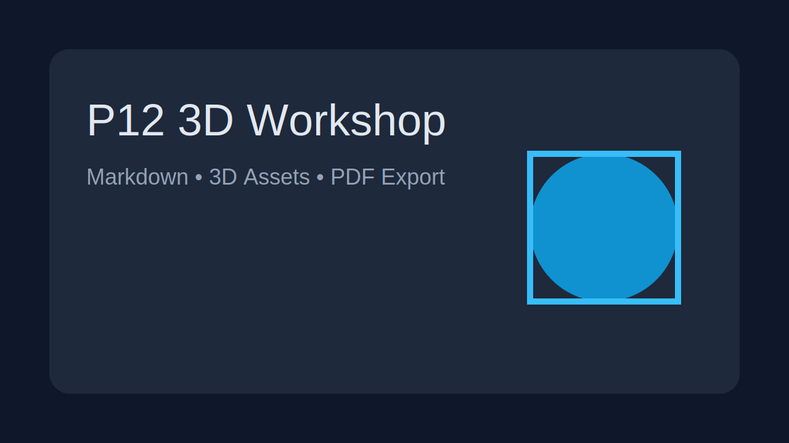

# 3D-Druck Workshop – Tag 1

## Einführung, Leveln, Slicer und erster Druck

---

---

# Programmübersicht I 

## Theorie – ca 30 Minuten
- Einführung in den FDM-3D-Druck
- Aufbau und Funktionsweise eines 3D-Druckers
- Materialien, Sicherheit und Druckvorbereitung
- First Layer und typische Startfehler

--- 

# Programmübersicht II

## Praxis – ca 90 Minuten
- Druckbett leveln
- Einführung in den Slicer
- Modell vorbereiten
- ersten Druck starten
- First Layer beobachten und bewerten

---

# Was ist FDM-3D-Druck?

**FDM** steht für **Fused Deposition Modeling**.

Dabei wird ein Kunststofffaden erhitzt und durch eine Düse gepresst.  
Das Material wird **Schicht für Schicht** abgelegt, bis ein Objekt entsteht.

**Typische Anwendungen:**
- Prototypen
- Halterungen
- Ersatzteile
- Modelle und Anschauungsobjekte

---

# Vom Modell zum Bauteil

1. 3D-Modell erstellen oder herunterladen
2. Modell im **Slicer** vorbereiten
3. Slicer erzeugt **G-Code**
4. Drucker liest den G-Code
5. Das Objekt entsteht Schicht für Schicht

---

# Aufbau eines FDM-3D-Druckers

Wichtige Bauteile:

- **Rahmen**
- **Druckbett**
- **Extruder**
- **Hotend**
- **Düse**
- **Filament**
- **X-, Y- und Z-Achse**
- **Lüfter**
- **Display / Steuerung**

---

# Extruder, Hotend und Düse

## Extruder
- transportiert das Filament

## Hotend
- erhitzt das Filament

## Düse
- trägt das geschmolzene Material auf

**Wichtig:**  
Material, Temperatur und Druckprofil müssen zusammenpassen.

---

# Druckbett und Achsen

## Druckbett
- darauf wird gedruckt
- muss sauber und richtig eingestellt sein

## Achsen
- **X:** links / rechts
- **Y:** vorne / hinten
- **Z:** oben / unten

**Ein guter Druck beginnt mit einem gut eingestellten Druckbett.**

---

# Materialien für den Einstieg

## PLA
- ideal für Einsteiger
- leicht zu drucken
- geringe Verformung
- für viele Alltagsmodelle geeignet

**Heute drucken wir mit PLA.**

---

## Weitere Materialien
- **PETG:** robuster, etwas anspruchsvoller
- **TPU:** flexibel, deutlich schwieriger
- **ASA:** Wetter- und UV-beständig 
- **Nylon:** Zäh, verschleißfest für technische u. mechanisch belastete Teile.

---
  
## Resin-Materialien
- **Standard Resin:** Sehr detailreich für Figuren und feine Prototypen.
- **Tough Resin:** Zäher und belastbarer als Standard Resin.
- **Flexible Resin:** Elastisch und biegbar bzw. stoßdämpfende.
- **High Temp Resin:** Hohe Wärmebeständigkeit.

---

## Professionelle Polymermaterialien
- **PA12:** Belastbare und präzise Bauteile.
- **PA11:** Noch schlagzäher als PA12.
- **CF-verstärkte Kunststoffe:** Sehr steif und leicht für Strukturteile.

---

## Metallmaterialien
- **Edelstahl:** Vielseitig, korrosionsbeständig.
- **Titan:** Sehr fest bei geringem Gewicht für Luftfahrt und Medizintechnik.
- **Aluminium:** Für sehr leichte Bauteile.
- **Inconel:** Hochtemperaturbeständige Nickel-Chrom(-Super)-Legierung

---

# Sicherheit beim 3D-Druck

- Düse und Hotend werden sehr heiß
- auch das Druckbett kann heiß sein
- bewegliche Teile nicht berühren
- keine losen Gegenstände im Arbeitsbereich
- Arbeitsplatz sauber halten
- Drucke nicht unüberlegt anfassen oder lösen

---

# Druckvorbereitung

Vor jedem Druck prüfen:

- Ist das richtige Filament eingelegt?
- Ist das Druckbett sauber?
- Ist die Düse frei?
- Ist das Bett gelevelt?
- Passt das Materialprofil im Slicer?
- Ist das Modell sinnvoll ausgerichtet?

---

# Warum ist der First Layer so wichtig?

Die erste Schicht entscheidet oft über Erfolg oder Misserfolg.

Ein guter First Layer ist:

- gleichmäßig
- leicht zusammengedrückt
- geschlossen
- sauber haftend

**Wenn der First Layer nicht stimmt, scheitert oft der ganze Druck.**

---

# First Layer: Düse zu nah

**Anzeichen:**
- Material wird zu stark plattgedrückt
- Oberfläche wirkt gequetscht
- Linien sehen unruhig aus
- Düse kratzt eventuell

**Mögliche Folgen:**
- unsauberes Druckbild
- Materialstau
- schlechte Oberflächenqualität

---

# First Layer: Düse zu weit weg

**Anzeichen:**
- Linien haften schlecht
- Bahnen liegen lose auf
- Lücken zwischen den Linien
- Filament wird mitgezogen

**Mögliche Folgen:**
- schlechte Haftung
- abgelöste erste Schicht
- Druck bricht früh ab

---

# Häufige Fehler am Anfang

- Druckbett nicht richtig gelevelt
- Druckbett verschmutzt
- falsche Temperatur
- falsches Slicer-Profil
- Modell ungünstig platziert
- Druck gestartet, ohne die ersten Minuten zu beobachten

---

# Was macht ein Slicer?

Ein **Slicer** übersetzt ein 3D-Modell in Druckbefehle für den Drucker.

Er übernimmt zum Beispiel:

- Modell laden
- positionieren
- drehen
- skalieren
- Schichteinstellungen festlegen
- G-Code exportieren

---

# Wichtige Slicer-Einstellungen

- Druckerprofil
- Materialprofil
- Layerhöhe
- Infill
- Wände / Perimeter
- Geschwindigkeit
- Support
- Brim / Skirt

**Für den Einstieg gilt:**  
Lieber mit einem bewährten Standardprofil arbeiten.

---

# Geeignete erste Druckmodelle

Für den Einstieg eignen sich:

- Kalibrierquadrat
- kleiner Würfel
- einfacher Schlüsselanhänger
- Namensschild
- flaches Testobjekt

**Warum einfache Modelle?**
- schnell fertig
- Fehler gut sichtbar
- Fokus auf den Grundlagen

---

# Praxisblock – Ablauf

## 1. Drucker vorbereiten
- Gerät einschalten
- Filament prüfen
- Druckbett kontrollieren

## 2. Bett leveln
- Home anfahren
- Abstand mit Papier prüfen
- an mehreren Punkten einstellen

---

## 3. Slicer nutzen
- Modell laden
- ausrichten
- Profil wählen
- G-Code erzeugen

## 4. Druck starten
- Datei übertragen
- ersten Druck beginnen
- First Layer beobachten

---

# Druckbett leveln – Grundprinzip

**Ziel:**  
Der Abstand zwischen Düse und Druckbett muss passend sein.

## Klassische Methode
- Drucker homen
- Düse an mehrere Positionen bewegen
- Papier zwischen Düse und Bett prüfen
- Einstellräder anpassen

**Merksatz:**  
Das Papier soll leicht kratzen, aber nicht festklemmen.

---

# Worauf achten wir beim ersten Druck?

- Haftet die erste Linie?
- Sind die Linien gleichmäßig?
- Gibt es sichtbare Lücken?
- Wird das Material zu stark gedrückt?
- Bleibt das Modell an Ort und Stelle?

**Die ersten Minuten entscheiden.**

---

# Ziel der Praxis

- das Bett gelevelt oder überprüft
- ein Modell im Slicer vorbereitet
- einen ersten Druck gestartet
- den First Layer bewusst bewertet

---

# Zusammenfassung

- wie FDM-3D-Druck funktioniert
- welche Bauteile wichtig sind
- welche Sicherheitsregeln gelten
- warum der First Layer entscheidend ist
- wie ein Slicer eingesetzt wird
- wie ein erster Druck vorbereitet und gestartet wird

---

# Ausblick auf Tag 2

- Druckqualität verbessern
- häufige Fehler gezielt beheben
- komplexere Modelle vorbereiten
- Support und Ausrichtung besser verstehen
- praktische Tipps aus dem Alltag

---

## Jetzt geht es an den ersten Druck

